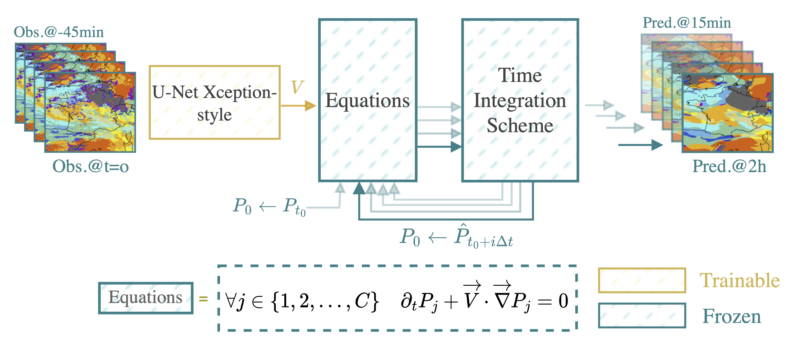
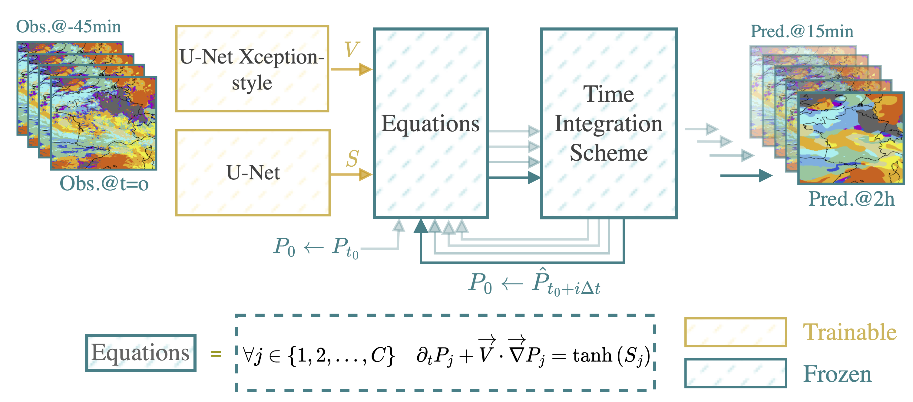
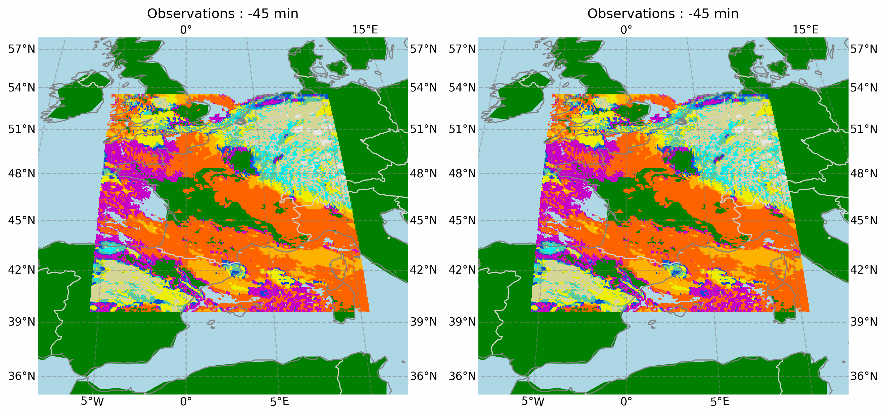
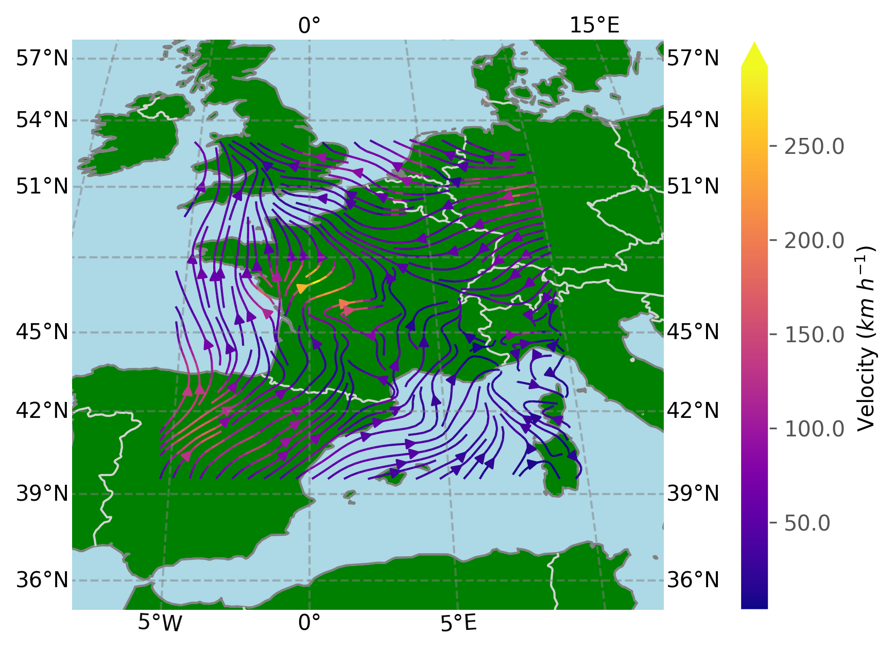

# HyPhAI: Hybrid Physics-AI Approach for Cloud Cover Nowcasting
This repository contains the source code for the paper "Hybrid Physics-AI Architecture for Cloud Cover Nowcasting" by [Rachid El Montassir](https://www.linkedin.com/in/rachid-elmontassir/), [Olivier Pannekoucke](https://github.com/opannekoucke) and [Corentin Lepeyre](https://github.com/clapeyre).

## Abstract
This work proposes a hybrid approach that combines physics and Artificial Intelligence (AI) for cloud cover nowcasting. It addresses the limitations of traditional deep learning methods in producing realistic and physically consistent results that can generalize to unseen data. The proposed approach enforces a physical behaviour, in the first model, denoted HyPhAI-1, a multi-level advection dynamics is considered as a hard constraint for a trained U-Net model. Our experiments show that the hybrid formulation outperforms not only traditional deep learning methods, but also the EUMETSAT Extrapolated Imagery model (EXIM) in terms of both qualitative and quantitative results. In particular, we illustrate that the hybrid model preserves more details and achieves higher scores based on similarity metrics in comparison to the U-Net. Remarkably, these improvements are achieved while using only one-third of the data required by the other models. Another model, denoted HyPhAI-2, adds a source term to the advection equation, it impaired the visual rendering but displayed the best performance in terms of Accuracy.
These results suggest that the proposed hybrid Physics-AI architecture provides a promising solution to overcome the limitations of classical AI methods, and contributes to open up new possibilities for combining physical knowledge with deep learning models.

## HyPhAI-1 architecture


## HyPhAI-2 architecture


## Results (HyPhAI-1)
### Forecasts


### Estimated velocity field


### Full disk forecasts


## Citation
To cite this work, please use the following bibtex entry:
```
@article{elmontassir2024hyphai,
  title={Hybrid Physics-AI Architecture for Cloud Cover Nowcasting},
  author={El Montassir, Rachid and Pannekoucke, Olivier and Lapeyre, Corentin},
  journal={Geoscientific Model Development},
  year={2024},
  publisher={Copernicus GmbH},
  %doi={Not yet available}
}
```

## License
This project is licensed under the CeCILL-B license - see the [LICENSE](LICENSE.md) file for details.
