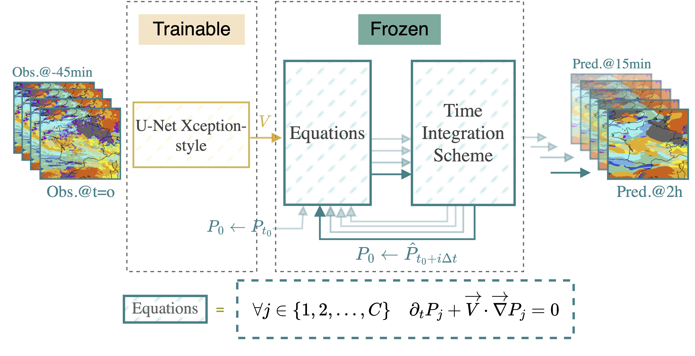
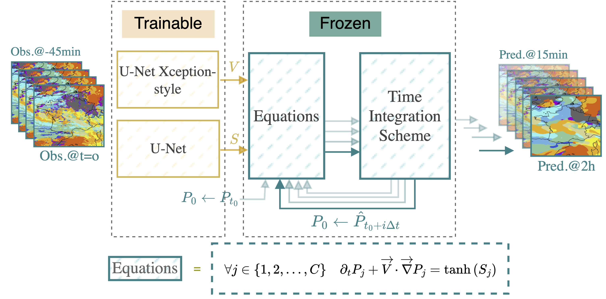
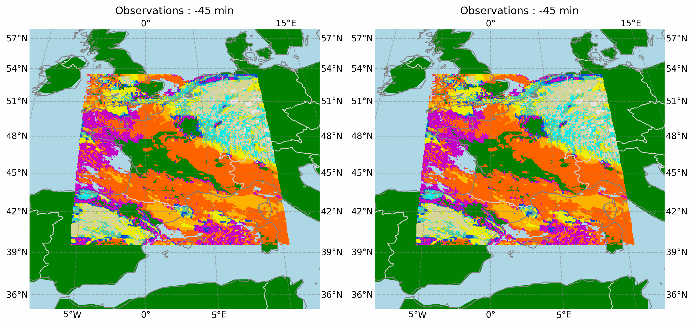
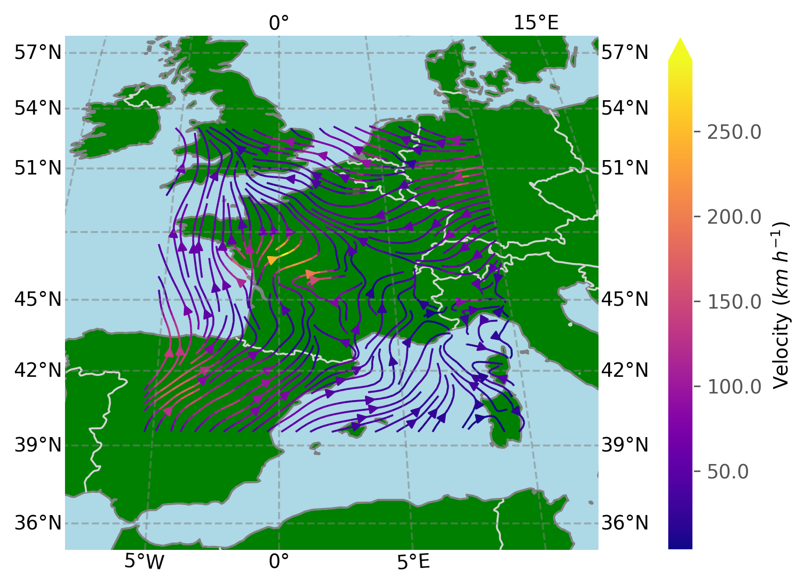

# HyPhAICC v1.0: A Hybrid Physics-AI approach for probability fields advection, application to cloud cover nowcasting
This repository contains the source code for the paper "[HyPhAICC v1.0: A Hybrid Physics-AI approach for probability fields advection, application to cloud cover nowcasting](https://egusphere.copernicus.org/preprints/2024/egusphere-2023-3078)" by [Rachid El Montassir](https://www.linkedin.com/in/rachid-elmontassir/), [Olivier Pannekoucke](https://github.com/opannekoucke) and [Corentin Lepeyre](https://github.com/clapeyre).

[](https://zenodo.org/doi/10.5281/zenodo.10401953)

## Abstract
This work proposes a hybrid approach that combines Physics and Artificial Intelligence (AI) for cloud cover nowcasting. It addresses the limitations of traditional deep learning methods in producing realistic and physically consistent results that can generalise to unseen data. The proposed approach, named HyPhAICC, enforces a physical behaviour. In the first model, denoted HyPhAICC-1, a multi-level advection dynamics is considered as a hard constraint for a trained U-Net model. Our experiments show that the hybrid formulation outperforms not only traditional deep learning methods, but also the EUMETSAT Extrapolated Imagery model (EXIM) in terms of both qualitative and quantitative results. In particular, we illustrate that the hybrid model preserves more details and achieves higher scores based on similarity metrics in comparison to the U-Net. Remarkably, these improvements are achieved while using only one-third of the data required by the other models. Another model, denoted HyPhAICC-2, adds a source term to the advection equation, it impaired the visual rendering but displayed the best performance in terms of Accuracy. These results suggest that the proposed hybrid Physics-AI architecture provides a promising solution to overcome the limitations of classical AI methods, and contributes to open up new possibilities for combining physical knowledge with deep learning models.

## HyPhAICC-1 architecture


## HyPhAICC-2 architecture


## Results (HyPhAICC-1)
### Forecasts


### Estimated velocity field


### Inference on full disk, without any specific training.


## Citation
To cite this work, please use the following bibtex entry:

```
@Article{egusphere-2023-3078,
  AUTHOR = {El Montassir, R. and Pannekoucke, O. and Lapeyre, C.},
  TITLE = {HyPhAICC v1.0: A Hybrid Physics-AI approach for probability fields advection, application to cloud cover nowcasting},
  JOURNAL = {EGUsphere},
  VOLUME = {2024},
  YEAR = {2024},
  PAGES = {1--38},
  URL = {https://egusphere.copernicus.org/preprints/2024/egusphere-2023-3078/},
  DOI = {10.5194/egusphere-2023-3078}
}
```
## License
This project is licensed under the CeCILL-B license - see the [LICENSE](LICENSE.md) file for details.
